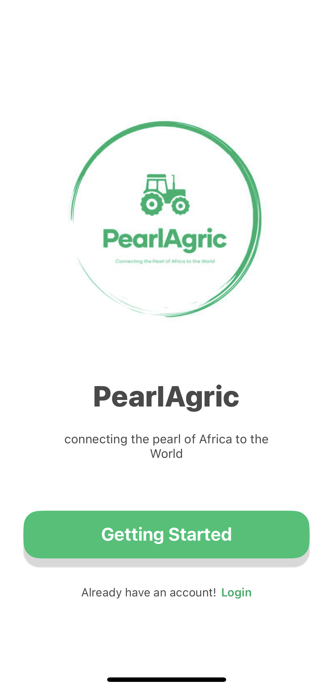
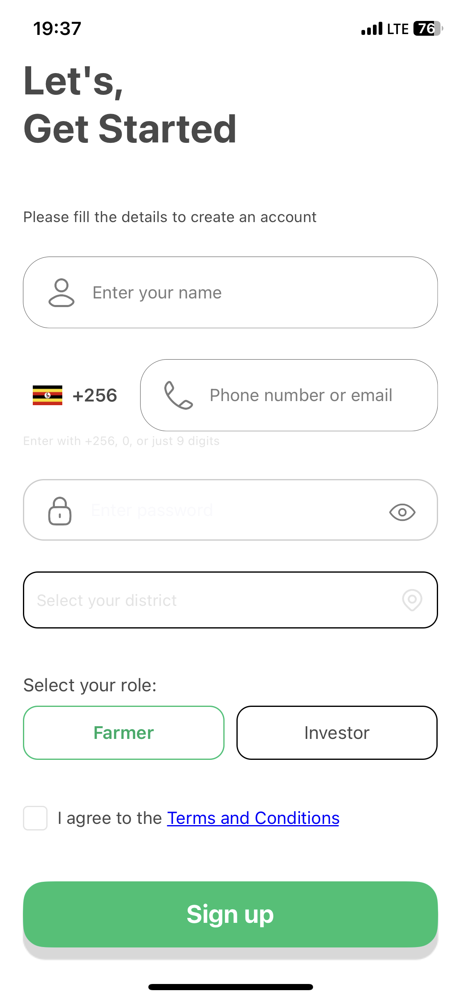
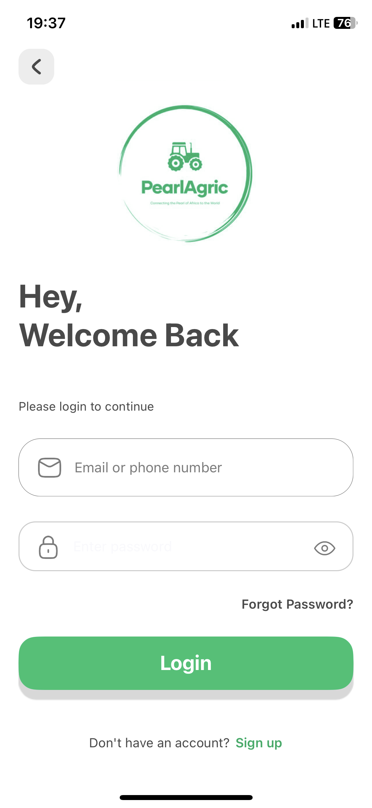
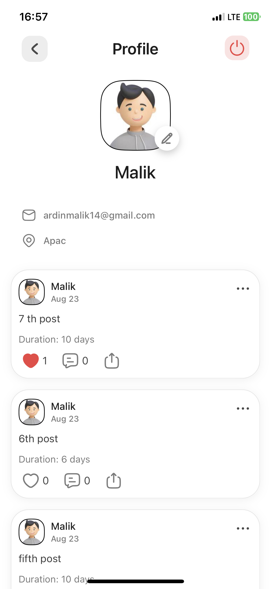

# 🌱 PearlAgric Landing Page

## 📌 Overview
PearlAgric is a platform that connects **farmers** with **investors**, enabling funding for agricultural projects.  

This repository contains the **landing page**, built with **HTML and CSS**, designed to inform users about the platform and prompt them to **download the upcoming mobile app**.  
The full app will be available soon, bringing additional features for farmers and investors.

---

## ⚙️ Sections
- **Mission:** Learn about PearlAgric’s purpose and goals  
- **Features:** Discover the key benefits and functionalities of the platform  
- **Download:** Get ready to download the mobile app when it becomes available  

---

## 🛠️ Tech Stack
- **Frontend:** HTML, CSS  
- **Deployment:** Vercel  

---
## 📱 Upcoming PearlAgric App (Preview)

Here’s a sneak peek of the full mobile app currently under development with **React Native and Supabase**.

### Screenshots

**Welcome Screen**  


**Signup Screen**  


**Login Screen**  


**Profile Screen**  


**Home Screen**  


**Comment Section**  


## 🚀 Setup & Installation
1. Clone the repository  
   ```bash
   git clone https://github.com/your-username/pearl-agric-landing.git
